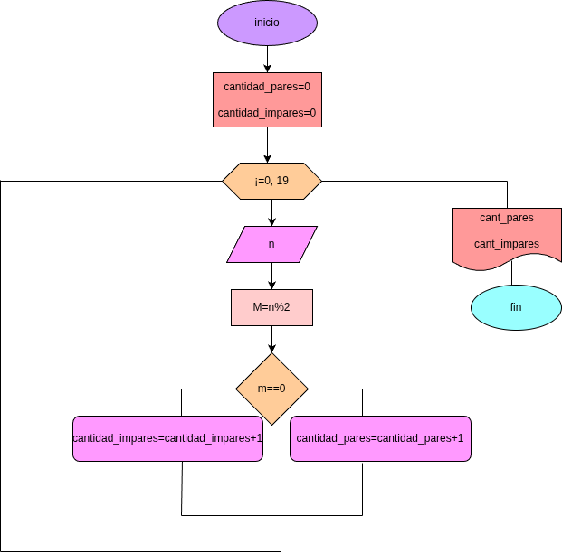

# for_1
programa de python para calcular las cantidades numeros pares e impares insertados por el usuario

## problema
- hacer el diagrama y el programa en python, que lea 20 numeros y que averigue de forma individual que son pares e impares 

# diagra de flujo

GRACIAS

# problema 2
hacer digrama de flujo y el programa de python que avirigue e imprima cuantos multiples de 7, y cuantos multiplos de 9 hay en los numeros comprendidos entre 100 y 5000